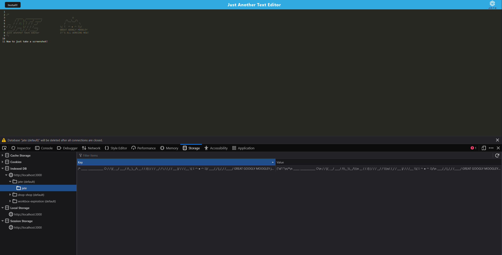

# Simply Just Another Text Editor

A simple text editor that is a Progressive Web App and allows itself to be installed to be used offline as well as use IndexedDB to store text.

## Description

This web app is used as practice on how to create a Progressive Web Application (PWA) that can be installed locally so that it will still function even if internet connectivity is lost. It uses Webpack to create the dist folder which will be deployed to the client. Data is stored on the locally created IndexedDB. IndexedDB is used over storing data in DOM Storage as IndexedDB can better handle larger, structured data files.

## Installation

To install locally, all that needs to be done is clicking on the "Install" button in the upper left. Then click through the dialogs.

To uninstall in Chrome, click on the three vertical dots and select "Uninstall Just Another Text Editor..."

## User Story

```md
AS A developer
I WANT to create notes or code snippets with or without an internet connection
SO THAT I can reliably retrieve them for later use
```

## Acceptance Criteria

```md
GIVEN a text editor web application
WHEN I open my application in my editor
THEN I should see a client server folder structure
WHEN I run `npm run start` from the root directory
THEN I find that my application should start up the backend and serve the client
WHEN I run the text editor application from my terminal
THEN I find that my JavaScript files have been bundled using webpack
WHEN I run my webpack plugins
THEN I find that I have a generated HTML file, service worker, and a manifest file
WHEN I use next-gen JavaScript in my application
THEN I find that the text editor still functions in the browser without errors
WHEN I open the text editor
THEN I find that IndexedDB has immediately created a database storage
WHEN I enter content and subsequently click off of the DOM window
THEN I find that the content in the text editor has been saved with IndexedDB
WHEN I reopen the text editor after closing it
THEN I find that the content in the text editor has been retrieved from our IndexedDB
WHEN I click on the Install button
THEN I download my web application as an icon on my desktop
WHEN I load my web application
THEN I should have a registered service worker using workbox
WHEN I register a service worker
THEN I should have my static assets pre cached upon loading along with subsequent pages and static assets
WHEN I deploy to Heroku
THEN I should have proper build scripts for a webpack application
```

## Example Picture



## Credits

- Chelsea Wagner -https://github.com/caf62219 - starting code and general setup
- Donnie Rowlings - https://github.com/drawlin22 - starting code and general setup
- Colton Firestone - https://github.com/ColtonMakesStuff - fixing IndexedDB not functioning properly
- Jamie Otto and Jeyhun Jung - helping fix Service Worker failing to start

## Links:

- Link to repo:
  https://github.com/Kylyote/bootcamp-text-editor
- Link to Heroku deploy:
  https://bootcamp-simple-text-editor-b9bb1526f0ea.herokuapp.com/
